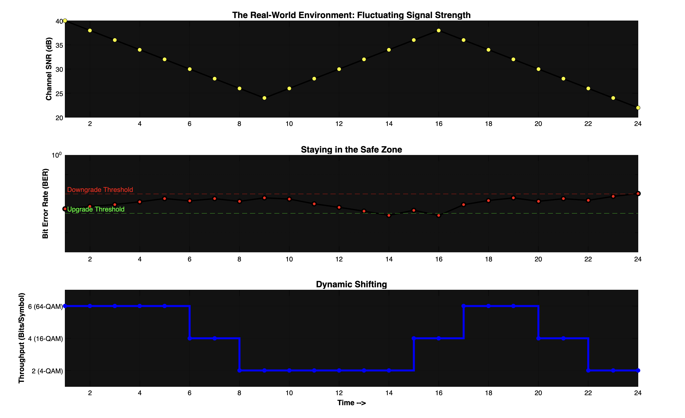

# M-QAM Adaptive Modulation and Coding (AMC) over Rayleigh Fading


This repository contains a complete Digital Signal Processing (DSP) pipeline and closed-loop feedback simulation for a **5G-compliant Adaptive M-QAM receiver**. It demonstrates the real-time dynamic switching of modulation orders (4-QAM, 16-QAM, 64-QAM) in response to a fluctuating Rayleigh fading channel, ensuring a target Bit Error Rate (BER) is maintained while maximizing throughput.

## System Architecture

The core of this project is a multi-rate Simulink model simulating a complete physical layer (PHY) communications link. 


### Key DSP Components:
* **Pulse Shaping:** Transmit and Receive Root Raised Cosine (RRC) filters with an upsampling factor of 8.
* **Fading Channel:** Rayleigh SISO multipath fading block simulating real-world vehicular/pedestrian mobility with a specific Doppler shift.
* **AWGN Noise Injection:** Mathematically rigorous noise addition that accounts for upsampling and variable bits-per-symbol (converting $E_b/N_0$ to Sample SNR).
* **Zero-Forcing (ZF) Equalizer:** Reverses phase rotations and amplitude distortions caused by the Rayleigh channel ($R(t)/h(t)$).
* **Delay Synchronization:** Precise frame-buffer alignment dynamically calculated to match the RRC filter taps for flawless BER calculation.

---

##  Core Simulations

This repository features two distinct MATLAB runner scripts that interface with the Simulink model.

### 1. Multi-Rate BER Performance Sweep (`runsim.m`)
This script sweeps the channel from a noisy state to a clean state (14 dB to 44 dB) and plots the simulated hardware performance against theoretical mathematical baselines.


**Theoretical Highlights:**
* **Amplitude Restoration:** Compensates for the power reduction caused by the 8x upsampling in the TX RRC filter by applying a $\sqrt{8}$ gain, ensuring the Demodulator's decision boundaries receive exactly 1 Watt of signal power.
* **Variable Noise Variance:** Dynamically recalculates the precise noise floor required for the AWGN block whenever the modulation order $M$ changes, preserving a constant $E_b/N_0$ on the X-axis.

### 2. 5G Mobility: Closed-Loop AMC (`Adaptive.m`)
This script simulates a true 5G mobile environment. Instead of maintaining a static modulation, it acts as a **Link Adaptation Supervisor**, monitoring the channel and shifting gears in real-time.



**How the Algorithm Works:**
1. **The Environment (Top Plot):** The simulated user moves through the world, causing the Signal-to-Noise Ratio to drop into deep fades and rise into clear peaks.
2. **The Feedback Loop (Middle Plot):** The script measures the true BER at the end of every transmission frame. 
   * If BER $> 5 \times 10^{-3}$: The channel is failing. The system **downgrades** to a more robust modulation (e.g., 64-QAM $\rightarrow$ 16-QAM).
   * If BER $< 10^{-3}$: The channel is clean. The system **upgrades** to a denser modulation to maximize data speeds.
3. **Dynamic Throughput (Bottom Plot):** The "Throughput Staircase." Watch the system throttle from 2 bits/symbol (4-QAM) up to 6 bits/symbol (64-QAM) exactly as the signal clears up.

---

## Visualizing the Channel (Constellation Dynamics)

*Watch the Zero-Forcing Equalizer and Demodulator fight through the noise in real-time as the channel degrades and improves.*

| Adaptive Gear Shifting | Fading Noise Variance |
| :---: | :---: |
| <video src="gif_adaptive.mp4" width="400" controls></video> | <video src="gif_constellation.mp4" width="400" controls></video> |
| *Visualizing the constellation dynamically adapting as the algorithm shifts between 4-QAM, 16-QAM, and 64-QAM.* | *Observing the noise variance swallow the decision boundaries during a simulated signal drop.* |

---

##  Requirements & Usage

### Prerequisites
* **MATLAB** (Recommended R2023a or newer)
* **Simulink**
* **Communications Toolbox**
* **DSP System Toolbox**

### How to Run
1. Clone the repository and open the folder in MATLAB.
2. Ensure `Adaptive_Final.slx`, `runsim.m`, and `Adaptive.m` are in the same working directory.
3. To view the standard performance curves, run:
   ```matlab
   runsim
